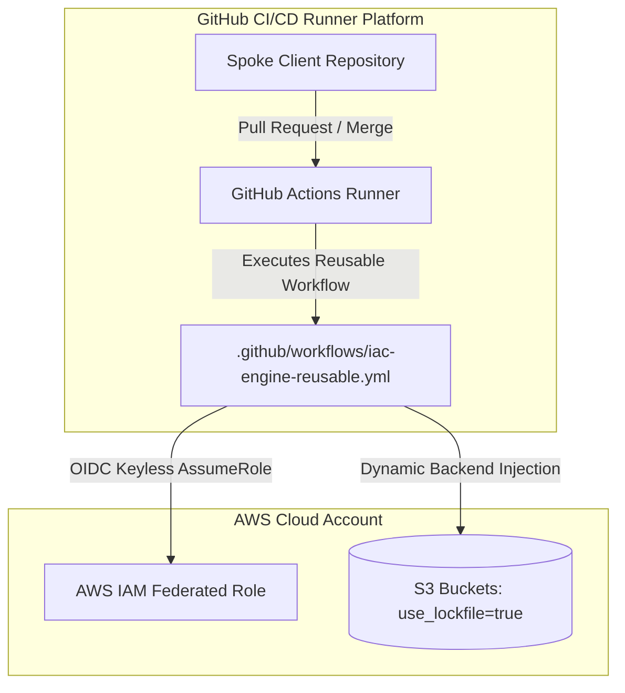
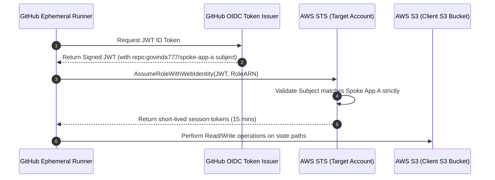

# Motor de IaC Centralizado (Hub) - Visão Geral

Este repositório centralizado (`govinda777/iac-engine`) atua como o **Hub de Engenharia de Plataforma** da nossa organização, gerenciando as execuções de Infraestrutura como Código (IaC) de todos os repositórios clientes organizacionais (**Spokes**).

A **iac-engine** posiciona-se como um **gatekeeper de segurança de alta governança** e um **gestor de ciclo de vida ponta a ponta**. O cliente fornece a sua identidade via OIDC, e a engine valida a conformidade e executa o provisionamento de forma 100% transparente e efémera.

A arquitetura baseia-se no **Paradigma de Inversão de Controlo via Pipelines Centralizadas e Runners Efémeros**. Sob uma premissa estritamente *serverless* e efémera, **não mantemos nenhuma infraestrutura ou computação gerenciada ativa por nós na AWS** (sem clusters EKS dedicados, sem instâncias EC2 persistentes, sem Lambdas e sem bases de dados DynamoDB).



### Benefícios de Custo Zero de Infraestrutura AWS
1. **Computação 100% Efémera:** Toda a computação de processamento de IaC ocorre estritamente sob demanda em runners padrão hospedados pelo GitHub (*GitHub-hosted runners*), resultando em **manutenção operacional nula** e custo zero de servidores em inatividade.
2. **Eliminação do DynamoDB:** Ao adotarmos a propriedade nativa `use_lockfile = true` das versões modernas do Terraform/OpenTofu, os bloqueios concorrentes de escrita (*state locking*) ocorrem de forma nativa e direta sob os objetos do bucket S3. Não há necessidade de criar ou pagar por tabelas DynamoDB para controle de simultaneidade.
3. **Sem Servidores de Varredura:** Auditorias periódicas de desvios (*drift*) rodam de forma reativa através de Cron Jobs integrados e gratuitos na própria infraestrutura do GitHub Actions.

---

## Estrutura do Projeto

O layout físico do repositório centralizado do Hub organiza-se de forma clara para isolar a inteligência operacional de pipelines, componentes IaC homologados e documentação do produto:

```text
iac-engine/ (Repositório Hub Central)
├── .github/
│   └── workflows/
│       ├── iac-engine-reusable.yml  # O workflow reutilizável principal (produção)
├── docs/                            # Documentação aprofundada da plataforma
│   ├── adr/
│   │   └── 002_inversion_of_control_lifecycle.md # Inversão de Controle do Ciclo de Vida (ADR-002)
│   ├── templates/
│   │   ├── adr_template.md          # Template para novas ADRs
│   │   └── rfc_template.md          # Template para novas RFCs de Segurança/Ciclo de Vida
│   ├── README.md                    # Posicionamento global e guia da pasta docs
│   ├── architectural_roadmap_paradigms.md # Roadmap evolutivo multi-paradigmas (vCluster/Crossplane)
│   ├── authentication_onboarding.md # Onboarding de Autenticação OIDC e Trust Policies
│   ├── business_documentation.md     # Alinhamento executivo, ROI e roadmap trimestral
│   ├── lifecycle_management.md      # Gerenciamento automático de ciclo de vida (Git Event -> Engine)
│   ├── security_gateways.md         # Gateways de Segurança, OPA e Resource Control Policies (RCPs)
│   └── serverless_native_iac_engine.md # Especificação detalhada do motor efémero nativo
├── scripts/
│   └── lint_security.py             # Script automatizado de lint de segurança e backend-less
├── Makefile                         # Comandos rápidos de governança local (make lint-security)
└── README.md                        # Esta documentação técnica global do Hub
```

---

## Guia de Integração para Repositórios Clientes (Spokes)

Integrar um repositório cliente (Spoke) com o motor central do Hub é simples e requer apenas dois passos:

### Passo 1: Declarar o Bloco de Backend Vazio no Spoke
O Spoke não deve parametrizar ou expor chaves no bloco de backend. O arquivo HCL deve conter estritamente um bloco S3 vazio. O motor do Hub encarregar-se-á de injetar as propriedades corretas em tempo de execução.

```hcl
# File: backend.tf (No repositório do cliente Spoke)
terraform {
  backend "s3" {}
}
```

### Passo 2: Criar o Workflow de Invocação de CI/CD no Spoke
Crie o ficheiro de workflow de pipeline do GitHub Actions no repositório Spoke de forma a chamar o workflow reutilizável do Hub. Os desenvolvedores passam apenas as variáveis declarativas e o bucket de destino:

```yaml
# File: .github/workflows/deploy.yml (No repositório do cliente Spoke)
name: IaC Execution Pipeline

on:
  pull_request:
    branches: [ "main" ]
  push:
    branches: [ "main" ]

jobs:
  iac-provisioning:
    # Point directly to the central Govinda777 iac-engine reusable core
    uses: govinda777/iac-engine/.github/workflows/iac-engine-reusable.yml@feat/centralized-iac-engine-docs-8851655547615092863
    with:
      environment: prod
      aws_region: us-east-1
      state_bucket: govinda777-iac-states-prod
      iam_role_arn: arn:aws:iam::123456789012:role/govinda777-spoke-app-a-role
    permissions:
      id-token: write      # Crucial to authorize AWS keyless OIDC authentication
      contents: read       # To checkout client code
      pull-requests: write # To publish markdown plans in PR interface
```

---

## Modelo de Segurança e Governança (OIDC & Multi-Tenancy)

O nosso modelo de governança multi-inquilino (*multi-tenancy*) garante isolamento total entre os Spokes clientes, prevenindo incidentes de segurança cibernética e acesso não autorizado entre ambientes.



### 1. OpenID Connect (OIDC) Keyless
Eliminamos 100% o uso de chaves e credenciais de nuvem estáticas no GitHub Actions. A autenticação baseia-se em criptografia assimétrica de curta duração. O GitHub Actions emite um token assinado digitalmente que o AWS STS valida em milissegundos para liberar permissões efémeras em memória. Saiba mais em [Onboarding de Autenticação](docs/authentication_onboarding.md).

### 2. Filtragem Estrita por Inquilino (sub claim)
As IAM Roles criadas nas contas da AWS contêm políticas de confiança (*Trust Policies*) extremamente rígidas que barram acessos cruzados. Uma requisição oriunda do repositório `spoke-app-b` é automaticamente rejeitada se tentar assumir a role de acesso do `spoke-app-a`:

```json
/* AWS IAM Role Trust Policy for Spoke App A */
{
  "Version": "2012-10-17",
  "Statement": [
    {
      "Effect": "Allow",
      "Principal": {
        "Federated": "arn:aws:iam::123456789012:oidc-provider/token.actions.githubusercontent.com"
      },
      "Action": "sts:AssumeRoleWithWebIdentity",
      "Condition": {
        "StringEquals": {
          "token.actions.githubusercontent.com:aud": "sts.amazonaws.com",
          "token.actions.githubusercontent.com:sub": "repo:govinda777/spoke-app-a:ref:refs/heads/main"
        }
      }
    }
  ]
}
```

---

## Gestão de Estado (S3 Lockfile)

A integridade dos ficheiros de estado da infraestrutura é mantida de forma isolada, resiliente e económica.

### Injeção Dinâmica de Estados
Durante o ciclo de execução no runner efémero, o workflow reutilizável do Hub lê a variável especial de contexto `${{ github.repository }}` (que retorna por exemplo `govinda777/spoke-app-a`) e injeta-a diretamente nas propriedades `-backend-config` durante o comando de inicialização, blindando o Spoke contra erros manuais ou falhas de configuração. Veja os detalhes em [Gestão de Ciclo de Vida](docs/lifecycle_management.md).

```bash
# Executed in-memory by the Hub Reusable Workflow
tofu init \
  -backend-config="bucket=govinda777-iac-states-prod" \
  -backend-config="key=clientes/${REPO_PATH}/terraform.tfstate" \
  -backend-config="region=us-east-1" \
  -backend-config="use_lockfile=true"
```

### S3 Native Locking (Zero DynamoDB)
Ao definir `use_lockfile = true` para o backend S3 no OpenTofu 1.8+ ou Terraform 1.10+, o motor do Hub instrui o provedor a utilizar a consistência forte nativa de escrita do **Amazon S3** para o controle de fechos de concorrência (*state lock*).

Este novo paradigma técnico elimina por completo a necessidade histórica de manter, provisionar e pagar por tabelas externas de DynamoDB, simplificando radicalmente o modelo de permissões e as políticas IAM necessárias de menor privilégio nas contas AWS.

---

## Validação de Segurança Pré-Envio (make lint-security)

Para mitigar erros e chaves estáticas antes do envio do código, disponibilizamos um comando de validação local no `Makefile`:

```bash
make lint-security
```

Este comando verifica se o seu código contém possíveis chaves estáticas vazadas da AWS e se todos os blocos de backend do Terraform estão em conformidade com o formato vazio exigido pela engine central. Veja mais detalhes em [Gateways de Segurança](docs/security_gateways.md).

---

## Documentação Adicional do Ecossistema

Para expandir o conhecimento operacional e de negócios sobre esta plataforma, consulte os documentos de referência na pasta `docs/`:

* **[Guia Técnico Global (README docs)](docs/README.md):** Visão unificada da pasta docs e detalhamento dos pilares lógicos do gatekeeper.
* **[Onboarding de Autenticação OIDC](docs/authentication_onboarding.md):** Como configurar as IAM Roles federadas com Trust Policies rígidas.
* **[Gateways de Segurança](docs/security_gateways.md):** Verificações SAST de segredos, validações de conformidade OPA e perímetros de dados via Resource Control Policies (RCPs).
* **[Gestão de Ciclo de Vida Automático](docs/lifecycle_management.md):** Detalhes da Inversão de Controle onde a engine diferencia automaticamente 'Preview' de 'Deploy'.
* **[Template de RFC de Segurança](docs/templates/rfc_template.md):** Modelo de Request For Comments para novas propostas de segurança/ciclo de vida.
* **[Template de ADR](docs/templates/adr_template.md):** Modelo para registro de decisões arquiteturais.
* **[ADR-002: Inversão de Controle do Ciclo de Vida](docs/adr/002_inversion_of_control_lifecycle.md):** Decisão de delegar à engine (Hub) quando planejar ou aplicar com base em eventos do Git.
* **[Documentação de Negócio, Roadmap e Release Management](docs/business_documentation.md):** Analisa o alinhamento de negócios do projeto, métricas de ROI, cronograma em Quarters e governança de releases.
* **[Especificação Técnica do Motor Serverless Nativo](docs/serverless_native_iac_engine.md):** Uma especificação profunda da arquitetura do Motor de IaC Centralizado rodando 100% de forma nativa e efémera dentro da plataforma de CI/CD (sem computação própria na AWS e sem DynamoDB para locks).
* **[Roadmap de Paradigmas de Alta Maturidade](docs/architectural_roadmap_paradigms.md):** Um guia profundo que descreve a evolução de longo prazo da organização através dos 3 paradigmas de maturidade (Pipelines Centralizadas, Orquestradores de Stacks DRY, e Control Plane Cloud-Native com Crossplane/vCluster).
