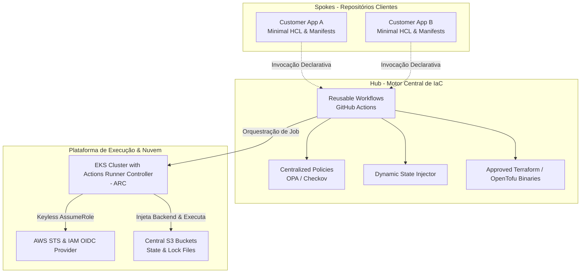
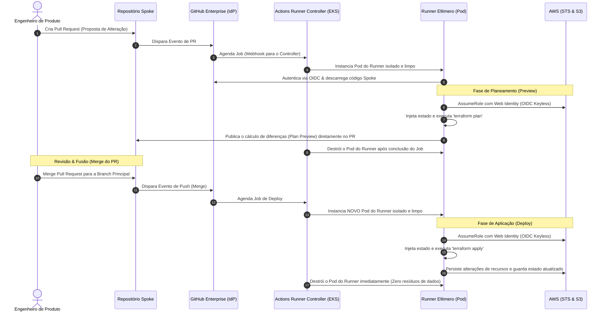
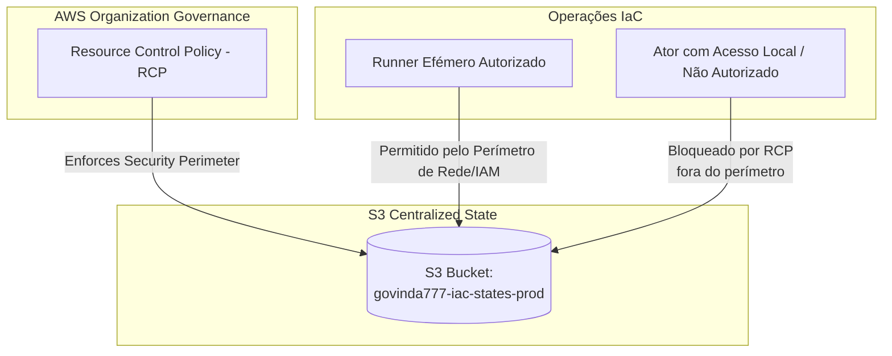
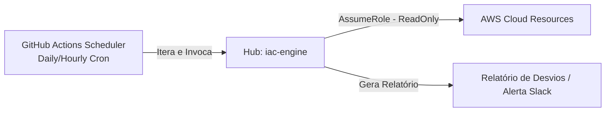

# Motor de IaC Centralizado: Paradigma de Inversão de Controlo via Pipelines Centralizadas e Runners Efémeros

## Visão Geral da Arquitetura (Modelo Hub-and-Spoke)

No modelo tradicional de Infraestrutura como Código (IaC), cada repositório de aplicação ou infraestrutura mantém a sua própria definição de pipelines de CI/CD, binários locais e chaves de acesso. Esse cenário resulta em problemas crónicos de desvio de configuração (*pipeline drift*), complexidade de manutenção de segurança e ausência de padronização organizacional.

O **Motor de IaC Centralizado** adota o modelo **Hub-and-Spoke** para pipelines de CI/CD, desacoplando completamente a definição técnica de execução (*how*) da declaração de recursos desejada (*what*).



### Separação de Responsabilidades

1. **O Hub (Motor Central):**
   * **Propriedade:** Equipa de Engenharia de Plataforma (*Platform Engineering*).
   * **Responsabilidade:** Contém a inteligência operacional, os fluxos reutilizáveis do GitHub Actions (*reusable workflows*), as políticas centrais de conformidade (ex: Open Policy Agent, Checkov), as versões homologadas e assinadas dos binários do Terraform/OpenTofu, e o motor de injeção de estado dinâmico.
   * **Localização Real:** Organização `govinda777`, repositório `iac-engine`.
   * **Isolamento:** Os utilizadores finais não possuem permissões de alteração direta nos fluxos de trabalho do Hub, garantindo conformidade regulatória uniforme.

2. **Os Spokes (Repositórios Clientes):**
   * **Propriedade:** Equipas de Desenvolvimento / Engenharia de Produto (*Product Teams*).
   * **Responsabilidade:** Contém exclusivamente arquivos declarativos minimalistas (código HCL definindo a infraestrutura pretendida) e ficheiros de configuração de variáveis.
   * **Abstração:** Não declaram blocos de `backend`, não definem chaves de autenticação de nuvem, nem configuram passos de CI/CD. Em vez disso, chamam de forma declarativa e minimalista o fluxo reutilizável do Hub.

### Configuração de Invocação no Spoke (Referência Real)

Durante a fase de desenvolvimento, testes ou para referenciar estritamente a branch funcional atual do motor, o Spoke deve invocar o workflow centralizado com a seguinte sintaxe:

```yaml
# Example: Spoke Workflow Configuration
# File: .github/workflows/deploy.yml
name: IaC Spoke Execution

on:
  pull_request:
    branches: [ "main" ]
  push:
    branches: [ "main" ]

jobs:
  iac-execution:
    uses: govinda777/iac-engine/.github/workflows/iac-engine.yml@feat/centralized-iac-engine-docs-8851655547615092863
    with:
      environment: dev
      aws_region: us-east-1
    permissions:
      id-token: write
      contents: read
```

#### Governação de Versões pós-Merge (Boas Práticas)
Uma vez que as alterações tenham sido consolidadas e fundidas na branch principal (`main`), as equipas de produto (Spokes) **não devem** referenciar branches de desenvolvimento ou mesmo a branch `main` diretamente em produção, a fim de evitar quebras acidentais de pipeline (*pipeline drift*).

A boa prática exige que os Spokes fixem a versão utilizando tags semânticas estáveis do motor de IaC:

```yaml
    # Stable Production Reference (Semantic Tagging)
    uses: govinda777/iac-engine/.github/workflows/iac-engine.yml@v1.0.0
```

---

## Fluxo de Execução e Ciclo de Vida

Todo o ciclo de vida da infraestrutura é gerido por eventos Git que interagem diretamente com o **Actions Runner Controller (ARC)** hospedado em clusters AWS EKS corporativos.



### Detalhe das Fases de Execução

#### 1. Fase de Planeamento (Preview)
Ativada em eventos de proposta de alteração (`pull_request`). O motor de IaC realiza as seguintes operações:
* Executa a injeção dinâmica de configuração de backend.
* Analisa estaticamente o código HCL para identificar violações de políticas de segurança (ex: Checkov).
* Executa `terraform plan` de forma puramente consultiva.
* Traduz a saída do planeamento para um comentário de Markdown estruturado e publica-o diretamente no Pull Request (PR) correspondente. Isso garante total transparência técnica sem requerer que o programador tenha acesso direto à consola ou a segredos da AWS.

#### 2. Fase de Aplicação (Deploy)
Ativada estritamente após a aprovação e fusão (*merge*) da Pull Request na branch principal (`main`).
* O motor obtém credenciais de escrita temporárias via IAM OIDC.
* Executa `terraform apply` consumindo exclusivamente o plano que foi previamente revisto e aprovado.
* Atualiza os recursos na AWS e liberta o fecho de estado (*state lock*).

### Infraestrutura de Computação: Runners Efémeros

A execução das tarefas ocorre de forma totalmente descentralizada ao nível de computação através de **Runners Efémeros** orquestrados por **Actions Runner Controller (ARC)** em clusters Kubernetes no **Amazon EKS**.

* **Isolamento Total:** Cada job corre num Pod dedicado, limpo e isolado. Não existe partilha de sistema de arquivos ou de variáveis de ambiente entre jobs diferentes.
* **Ciclo de Vida Efémero:** Assim que um job de planeamento ou aplicação termina, o Pod que serviu de runner é **imediatamente destruído** pelo ARC.
* **Segurança de Resíduos:** A eliminação do Pod garante que segredos lidos em memória, ficheiros locais temporários do Terraform (como o diretório `.terraform/` ou ficheiros de plano `.tfplan`) e tokens temporários em memória sejam apagados para sempre, mitigando ataques de movimento lateral e o risco de desvio de dados (*data exfiltration*).

---

## Especificações de Segurança e Autenticação

O motor central elimina completamente a necessidade de gerir credenciais estáticas de longa duração (como AWS Access Keys criadas para utilizadores IAM).

### OIDC Keyless e AssumeRoleWithWebIdentity

O GitHub Enterprise atua como um provedor de identidade compatível com OpenID Connect (OIDC). O fluxo de autenticação e elevação de privilégios opera de forma *keyless*:

1. Ao iniciar, o runner efémero solicita um ID Token assinado digitalmente pelo GitHub Actions (um JWT em formato Web Token).
2. O runner envia este token para o **AWS STS (Security Token Service)** através da chamada `AssumeRoleWithWebIdentity`.
3. A AWS valida a assinatura do token contra o provedor de identidade configurado (`token.actions.githubusercontent.com`) e valida se o assunto do token está conforme os termos da política de confiança da IAM Role.
4. Se validado, a AWS responde com credenciais temporárias (ID de Chave, Chave Secreta e Session Token) válidas por um curto período (ex: 15 a 60 minutos), que são armazenadas estritamente em memória no runner.

```json
/* Example: AWS IAM Role Trust Policy for OIDC Federated Authentication */
{
  "Version": "2012-10-17",
  "Statement": [
    {
      "Effect": "Allow",
      "Principal": {
        "Federated": "arn:aws:iam::123456789012:oidc-provider/token.actions.githubusercontent.com"
      },
      "Action": "sts:AssumeRoleWithWebIdentity",
      "Condition": {
        "StringEquals": {
          "token.actions.githubusercontent.com:aud": "sts.amazonaws.com"
        },
        "StringLike": {
          "token.actions.githubusercontent.com:sub": "repo:govinda777/spoke-*:*"
        }
      }
    }
  ]
}
```

### Filtragem Estrita (`sub` claim)

Para impedir escalada de privilégios entre inquilinos (*tenants*) ou repositórios diferentes da mesma organização (por exemplo, evitar que o repositório `spoke-app-b` consiga assumir a Role do `spoke-app-a`), o motor aplica **filtragem estrita baseada na claim `sub` (subject)** do token do GitHub.

A política de confiança da IAM Role de cada aplicação cliente restringe o acesso validando o caminho completo do repositório correspondente:

```json
/* Strict Isolation Trust Condition for Spoke App A */
"Condition": {
  "StringEquals": {
    "token.actions.githubusercontent.com:aud": "sts.amazonaws.com",
    "token.actions.githubusercontent.com:sub": "repo:govinda777/spoke-app-a:ref:refs/heads/main"
  }
}
```

*(Nota: O uso de curingas como `repo:govinda777/spoke-*:*` no exemplo anterior destina-se a dar flexibilidade a uma role genérica de auditoria ou permissões restritas em lote, mas cada Spoke de Produção deve limitar rigorosamente o seu escopo à sua respetiva claim para isolamento impecável).*

### Segurança de Módulos (GIT_ASKPASS)

Em arquiteturas corporativas de grande escala, as receitas ou módulos privados de infraestrutura encontram-se alojados em repositórios privados do Git. Ao tentar consumir esses módulos através do Terraform/OpenTofu, as abordagens comuns apresentam falhas graves de segurança:
* **SSH-Keyscan:** Expor as impressões digitais de chaves SSH corporativas em comandos de build para preencher o ficheiro `known_hosts` abre vetores para ataques de falsificação (*spoofing* / *Man-In-The-Middle*).
* **SSH Keys Estáticas:** Partilhar chaves SSH globais com múltiplos repositórios viola o princípio do menor privilégio.

O Motor de IaC resolve este desafio utilizando o protocolo HTTPS nativo acoplado à injeção dinâmica de credenciais efémeras via `GIT_ASKPASS`.

Ao iniciar o processamento, o motor cria em memória um script executável efémero de autenticação e define a variável de ambiente `GIT_ASKPASS`. O Git utiliza este script em tempo de execução para recuperar de forma segura as credenciais efémeras (ex: um Token de Instalação de GitHub App ou o `GITHUB_TOKEN` do próprio Job) sem registar chaves ou passwords em logs ou ficheiros de configuração persistentes.

```bash
#!/usr/bin/env bash
# File: setup_git_auth.sh
# Purpose: Configure GIT_ASKPASS using in-memory ephemeral token to eliminate ssh-keyscan and static SSH keys.
# This script is generated at runtime by the Centralized IaC Engine.

set -euo pipefail

# 1. Create a secure in-memory temporary script
export GIT_ASKPASS_SCRIPT_PATH
GIT_ASKPASS_SCRIPT_PATH=$(mktemp -t git-askpass-XXXXXX.sh)

# 2. Write the askpass logic to return the ephemeral runner token
cat <<EOF > "$GIT_ASKPASS_SCRIPT_PATH"
#!/usr/bin/env bash
# Return the ephemeral GitHub token when prompted
echo "\${GITHUB_TOKEN}"
EOF

chmod +x "$GIT_ASKPASS_SCRIPT_PATH"

# 3. Export variables to enforce Git authentication over HTTPS
export GIT_ASKPASS="$GIT_ASKPASS_SCRIPT_PATH"
export GIT_TERMINAL_PROMPT=0

# Ensure Git uses HTTPS instead of SSH for the organization's private repositories
git config --global url."https://x-access-token@github.com/govinda777/".insteadOf "git@github.com:govinda777/"

# After run execution, the clean-up step inside the ephemeral runner container will remove the temporary script:
# rm -f "$GIT_ASKPASS_SCRIPT_PATH"
```

---

## Gestão de Estado (State) e Persistência

A persistência correta e segura do estado da infraestrutura (*state file*) é crucial para a integridade da plataforma.

### Injeção de Estado Dinâmico

O repositório cliente (Spoke) **não deve, sob nenhuma circunstância, declarar um bloco de backend completo ou parametrizado**. A sua única responsabilidade é declarar um bloco vazio de S3:

```hcl
# File: backend.tf inside Spoke repository
terraform {
  backend "s3" {}
}
```

Durante o ciclo de inicialização no runner efémero, o Motor de IaC calcula e infere o caminho de armazenamento exclusivo do Spoke de forma totalmente dinâmica e transparente. Utilizando a variável de contexto padrão do GitHub `github.repository` (que retorna o par `organização/nome-do-repositório`, ex: `govinda777/spoke-app-a`), o motor isola cada estado logicamente no bucket central:

```bash
# Executed by the central engine inside the ephemeral runner container
# The state key path is dynamically constructed using github.repository context
terraform init \
  -backend-config="bucket=govinda777-iac-states-prod" \
  -backend-config="key=spokes/govinda777/spoke-app-a/terraform.tfstate" \
  -backend-config="region=us-east-1" \
  -backend-config="use_lockfile=true"
```

### S3 Native Locking

Nas versões clássicas de infraestrutura AWS com Terraform, a concorrência e os bloqueios de estado requeriam obrigatoriamente uma tabela externa do DynamoDB para controlo distribuído de fechos (*state locks*). Isto gerava complexidade de manutenção, custos acrescidos e overhead na criação de regras de IAM complexas de leitura/escrita para tabelas DynamoDB de cada inquilino.

Com a introdução do **Terraform 1.10+** e **OpenTofu 1.8+**, é disponibilizado o **S3 Native Locking** ao definir a propriedade `use_lockfile = true`. O S3 gere os trincos e controlo de concorrência de forma puramente nativa através de recursos de consistência forte e capacidades de bloqueio de escrita internas do próprio serviço de armazenamento S3.

Esta funcionalidade elimina por completo a necessidade de manter tabelas DynamoDB dedicadas e simplifica drasticamente as permissões de IAM necessárias.

### Parâmetros de Configuração do Backend Centralizado

| Parâmetro | Tipo | Descrição | Exemplo de Runtime Injetado pelo Motor |
| :--- | :--- | :--- | :--- |
| `bucket` | `string` | Nome do S3 Bucket centralizado e protegido por RCPs. | `govinda777-iac-states-prod` |
| `key` | `string` | Caminho lógico seguro e isolado, derivado dinamicamente do contexto `github.repository`. | `spokes/govinda777/spoke-app-a/terraform.tfstate` |
| `region` | `string` | Região AWS de localização física do S3. | `us-east-1` |
| `use_lockfile` | `boolean` | Ativa o bloqueio de estado nativo do S3 (Terraform 1.10+ / OpenTofu 1.8+). | `true` |

---

## Governação e Políticas

Para garantir a segurança, integridade e conformidade de todo o ecossistema corporativo, o Motor de IaC Centralizado combina validações de pipeline com controlos estritos a nível da nuvem.



### Políticas de Controlo de Recursos (RCPs) Corporativas

As **Resource Control Policies (RCPs)**, recentemente disponibilizadas no ecossistema de governação da AWS Organizations, atuam como guardiãs de perimeterização de dados extremamente robustas. Ao contrário das SCPs tradicionais (que limitam ações de utilizadores e papéis na conta de destino), as RCPs aplicam controlos rígidos diretamente sobre os próprios recursos das contas (ex: S3 Buckets, Chaves KMS), prevenindo desvios acidentais ou intencionais de dados corporativos sensíveis.

O Motor de IaC utiliza as RCPs da AWS para impor um perímetro seguro sobre o bucket S3 de estados da infraestrutura:

1. **Perímetro de Origem Confiável:** A RCP organizacional garante de forma intransigente que apenas requisições originárias da rede corporativa ou de blocos CIDR específicos (onde os clusters EKS/ARC e runners efémeros executam) têm permissão para interagir com o bucket S3 de estados.
2. **Perímetro de Identidade Confiável:** Qualquer operação de leitura ou escrita nos dados de estado deve ser realizada por identidades IAM pertencentes à AWS Organization e que cumpram a regra estrita de AssumeRole de runners efémeros.
3. **Mitigação Absoluta de Acesso Direto:** Mesmo que um engenheiro de produto de forma maliciosa consiga extrair chaves de API temporárias locais, as tentativas de aceder aos buckets de estado a partir da sua máquina de desenvolvimento local serão bloqueadas liminarmente na origem pela RCP ao nível organizacional.

### Validação em Tempo de Execução na Pipeline

O motor central executa validações de segurança em linha antes de prosseguir com qualquer aplicação física de infraestrutura:

* **Validação de Código HCL (Checkov/Trivy):** Deteta configurações perigosas ou inseguras de recursos (ex: portas expostas ao público geral, discos sem cifra ativada).
* **Políticas Regulatórias de Infraestrutura (OPA/Rego):** Garante a conformidade de nomes de recursos, conformidade com as zonas de disponibilidade aceitáveis e a presença de etiquetas (*tags*) obrigatórias que permitam a imputação correta de custos financeiros de infraestrutura.
* **Cálculo Preventivo de Custos:** Integração opcional com calculadores de custos para exibir a diferença de custos diretos diretamente no Pull Request juntamente com as alterações lógicas.

---

## Alinhamento de Deteção de Drift (Desvios)

Uma característica inerente ao **Paradigma 1 (Pipelines Tradicionais de CI/CD)** é que a deteção de alterações de infraestrutura efetuadas diretamente na nuvem (fora da pipeline, via consola AWS ou CLI externa) é **reativa por natureza**. O motor de IaC tradicionalmente só toma conhecimento de um desvio (*drift*) quando um novo Pull Request ou commit é executado no Spoke, disparando um planeamento.

### Prática Recomendada de Governação (Cron Jobs Reativos)

Para contornar este limite de reatividade e mitigar riscos de desvio persistente sem afetar o fluxo de trabalho das equipas de desenvolvimento, o Motor de IaC Centralizado recomenda a implementação de **Cron Jobs automatizados e consultivos no Hub**:



1. **Agendador Centralizado:** O repositório central (`govinda777/iac-engine`) executa um fluxo de trabalho programado (ex: a cada 24 horas) via `schedule` do GitHub Actions.
2. **Varredura em Lote:** O fluxo lê a lista de Spokes registados e invoca de forma assíncrona uma execução de `terraform plan -detailed-exitcode` utilizando permissões apenas de leitura (*ReadOnly*).
3. **Alerta Proativo:** Se o Terraform/OpenTofu reportar um código de saída indicando que existem diferenças entre a configuração declarada no Spoke e o estado real da AWS, o motor publica um alerta imediato no canal do Slack da equipa proprietária e opcionalmente gera um issue automatizado no repositório do Spoke para correção.
