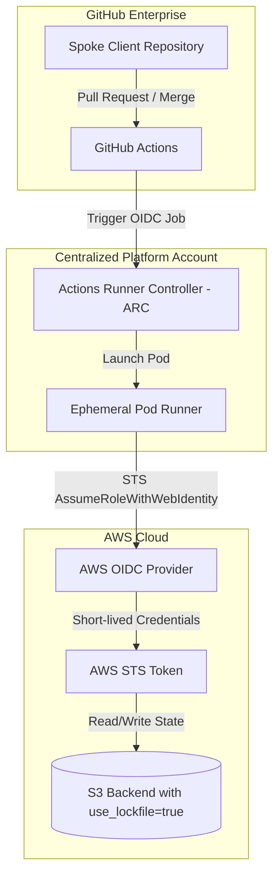
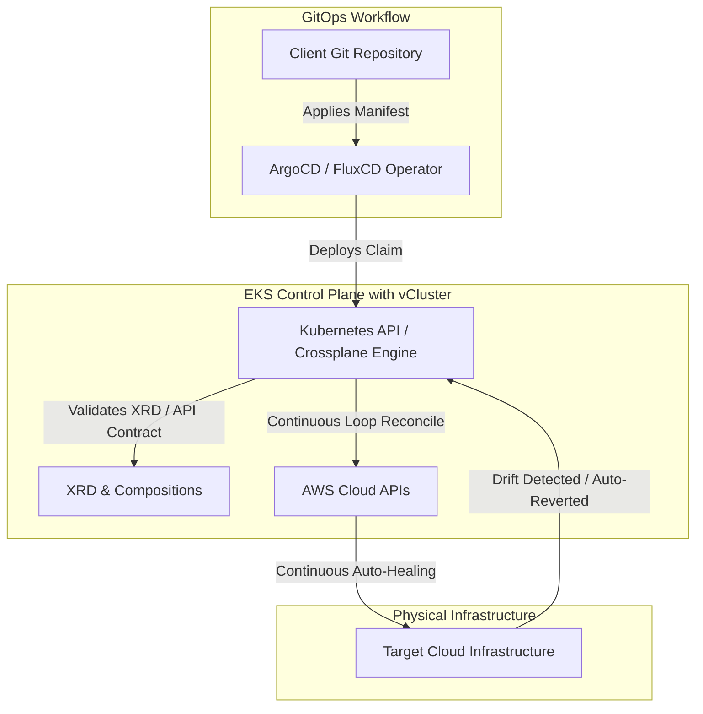

# Roadmap Evolutivo do Motor de IaC Centralizado: Da Inversão de Controlo ao Painel de Controlo Cloud-Native

Este documento apresenta o plano estratégico de evolução do **Motor de IaC Centralizado** da nossa organização. Atuando como Arquiteto de Soluções e Engenheiro de Plataformas Líder, esta jornada foi desenhada de forma pragmática para transitar a nossa engenharia de infraestrutura de um modelo fragmentado e de alto risco para um ecossistema autogestionável, seguro e de escala global.

---

## 1. Visão Geral da Jornada Evolutiva

A transição operacional é dividida em três níveis de maturidade técnica claros, garantindo que a organização resolva primeiro as dores mais críticas de segurança e governança de dados (Fase 1), consolide a eficiência e reduza a duplicação lógica (Fase 2) e, finalmente, atinja o estado da arte com conciliação contínua e autosserviço (Fase 3).

```
+------------------------------------+------------------------------------+------------------------------------+
|  FASE 1: Fundação & Segurança      |   FASE 2: Padronização & Escala    |  FASE 3: Reconciliação Contínua    |
|   (Paradigma 1: Hub-and-Spoke)     |     (Paradigma 2: Orquestradores)  |     (Paradigma 3: Control Plane)   |
+------------------------------------+------------------------------------+------------------------------------+
| * Autenticação Keyless OIDC        | * Introdução do Atmos/Terragrunt   | * Implementação de Crossplane      |
| * S3 Native Locking (No DynamoDB)  | * Metamódulos e Componentes DRY    | * Contratos de API (XRDs / Comps)  |
| * Runners Efémeros (ARC no EKS)    | * Manifestos YAML Hierárquicos     | * GitOps via ArgoCD / FluxCD       |
| * GIT_ASKPASS em memória           | * Interpolação Dinâmica de Estados | * Isolamento via vCluster          |
+------------------------------------+------------------------------------+------------------------------------+
| Maturidade: Baixa/Média            | Maturidade: Média/Alta             | Maturidade: Estado da Arte         |
| Foco: Eliminar Risco & Credenciais | Foco: Eficiência & DRY             | Foco: Zero-Drift, APIs & Autonomia |
+------------------------------------+------------------------------------+------------------------------------+
```

### Justificação da Trajetória

1. **Nível Inicial (Maturidade Baixa/Média):** Caracterizado pela fragmentação de pipelines, credenciais estáticas de longa duração na AWS armazenadas em segredos no GitHub Actions e falta de padronização na gestão de concorrência de estados. A **Fase 1** estanca de imediato estes riscos de segurança sem exigir refatorações massivas no código Terraform/OpenTofu legado dos clientes.
2. **Nível Intermédio (Maturidade Média/Alta):** Com a segurança mitigada, o foco vira-se para o combate à duplicação lógica e custos de manutenção (*pipeline e IaC drift*). A **Fase 2** introduz orquestradores estruturados de stacks, isolando a declaração lógica da execução e permitindo a herança paramétrica global, reduzindo drasticamente o código repetitivo (*boilerplate*).
3. **Nível Avançado (Maturidade Estado da Arte):** Pipelines tradicionais falham em mitigar alterações de infraestrutura manuais executadas diretamente na consola de nuvem (deteção reativa de drift). A **Fase 3** transita a organização para o modelo de **Control Plane Cloud-Native**, convertendo pedidos de infraestrutura em chamadas de APIs do Kubernetes (Custom Resource Definitions - CRDs) reconciliadas continuamente de forma automatizada por operadores dedicados.

---

## 2. Fase 1: Fundação & Segurança (Paradigma 1 - Hub-and-Spoke)

### Objetivo
Substituir a execução descentralizada de infraestrutura por uma execução puramente controlada e padronizada. Esta fase foca-se na eliminação de credenciais estáticas na nuvem, isolamento efémero do processamento de CI/CD e injeção automática de configurações de persistência (*state abstraction*).



### Entregáveis Técnicos

1. **Configuração de Topologia Hub-and-Spoke:**
   * **Hub Central (`govinda777/iac-engine`):** Guarda os workflows reutilizáveis (`.github/workflows/iac-engine.yml`) e a lógica centralizada de segurança do Terraform/OpenTofu.
   * **Spokes Clientes:** Repositórios sem qualquer definição local de backend ou variáveis de ambiente de provedores de nuvem, apenas contendo ficheiros declarativos HCL mínimos e invocando o Hub central.

2. **Runners Efémeros:**
   * Implementação do **Actions Runner Controller (ARC)** hospedado em clusters AWS EKS dedicados. Cada tarefa corre num Pod de Kubernetes isolado, com ciclo de vida efémero, sendo destruído pelo controller imediatamente após a conclusão do Job para garantir que nenhuns segredos ou ficheiros de plano de estado fiquem persistidos em disco local.

3. **Autenticação Federada via OIDC Keyless:**
   * Substituição de chaves de API estáticas. O runner efémero solicita tokens temporários OIDC da AWS através do método `sts:AssumeRoleWithWebIdentity`.
   * **Filtragem Estrita de Sub Claims:** Configuração de políticas de confiança (Trust Policies) IAM rígidas por conta cliente para evitar saltos laterais de privilégios entre Spokes. O filtro limita explicitamente as permissões:

```json
/* AWS IAM Trust Policy on Client AWS Account */
{
  "Version": "2012-10-17",
  "Statement": [
    {
      "Effect": "Allow",
      "Principal": {
        "Federated": "arn:aws:iam::123456789012:oidc-provider/token.actions.githubusercontent.com"
      },
      "Action": "sts:AssumeRoleWithWebIdentity",
      "Condition": {
        "StringEquals": {
          "token.actions.githubusercontent.com:aud": "sts.amazonaws.com"
        },
        "StringLike": {
          "token.actions.githubusercontent.com:sub": "repo:govinda777/spoke-*:*"
        }
      }
    }
  ]
}
```

4. **Resolução de Módulos Segura via `GIT_ASKPASS`:**
   * Criação de um script efémero em memória que injeta segredos dinâmicos (Tokens de Instalação do GitHub) e configura o Git via variável de ambiente `GIT_ASKPASS` para autenticar repositórios de módulos privados através do protocolo HTTPS, eliminando chaves SSH estáticas ou a dependência de varreduras vulneráveis de rede externa (`ssh-keyscan`).

5. **Abstração Total de Estado com S3 Native Locking:**
   * Os repositórios Spoke declaram apenas um bloco de backend vazio: `terraform { backend "s3" {} }`.
   * O motor central injeta dinamicamente as definições no runtime de inicialização (`terraform init -backend-config=...`), derivando os caminhos lógicos automaticamente de variáveis nativas como `github.repository` (ex: `govinda777/spoke-app-a`).
   * Configuração de **S3 Native Locking** (`use_lockfile = true` nas versões Terraform 1.10+ / OpenTofu 1.8+), excluindo a dependência e custo de bases de dados DynamoDB externas para concorrência de conciliação.

### Critérios de Sucesso e KPIs

* **Redução de Segredos de Nuvem Persistidos:** Meta de **100% de eliminação** de chaves estáticas IAM (`AWS_ACCESS_KEY_ID`, `AWS_SECRET_ACCESS_KEY`) nos repositórios e segredos do GitHub da organização.
* **Redução Drástica no Overhead de Recursos de Bloqueio:** **100%** dos novos Spokes provisionados utilizando S3 Native Locking sem criar tabelas DynamoDB dedicadas.
* **Isolamento de Execuções:** 100% das tarefas executadas em pods herméticos efémeros de Kubernetes que duram exatamente o tempo de vida do job.

---

## 3. Fase 2: Padronização & Escala DRY (Paradigma 2 - Orquestradores de Stacks)

### Objetivo
Eliminar a duplicação massiva de configurações de infraestrutura e unificar a árvore operacional de parâmetros. A Fase 2 foca-se na introdução de um orquestrador de stacks que define metamódulos reaproveitáveis, herança lógica e injeção semântica global de variáveis.

```
                  [ Organização (govinda777) ]
                               |
            +------------------+------------------+
            |                                     |
       [ Org-Wide YAML ]                     [ Account-Wide YAML ]
     Global tags, billing, region           AWS accounts mapping, EKS config
            |                                     |
            +------------------+------------------+
                               |
                     [ Component-Level YAML ]
                     Metamódulo VPC / RDS / EKS
```

### Entregáveis Técnicos

1. **Introdução de Orquestrador de Stacks (Atmos / Terragrunt):**
   * Configuração do orquestrador gerenciado diretamente pelas pipelines reutilizáveis do Hub central. Os clientes deixam de rodar Terraform puro de forma dispersa e passam a estruturar as suas necessidades em ficheiros de manifesto YAML padronizados.

2. **Criação de Metamódulos e Componentes de Referência:**
   * Desenvolvimento de componentes modulares de infraestrutura prontos e homologados pela equipa de plataforma (ex: `terraform-aws-vpc`, `terraform-aws-eks`, `terraform-aws-rds`). Estes componentes seguem padrões rígidos de arquitetura, segurança e FinOps corporativo por padrão.

3. **Estrutura Hierárquica DRY de Stacks:**
   * Implementação de uma árvore de manifestos YAML nos Spokes. Uma equipa declara os parâmetros específicos da sua aplicação importando as configurações globais da conta e organização automaticamente por herança lógica.

```yaml
# Example: Client Spoke YAML definition
# File: orgs/govinda777/prod/us-east-1/network-vpc.yaml
import:
  - orgs/govinda777/global-defaults
  - accounts/prod-defaults
  - regions/us-east-1-defaults

components:
  terraform:
    network-vpc:
      vars:
        vpc_cidr_block: "10.120.0.0/16"
        enable_nat_gateway: true
        single_nat_gateway: false
```

4. **Interpolação Dinâmica de Estados:**
   * O orquestrador mapeia automaticamente o caminho do ficheiro de estados S3 associando o caminho hierárquico da stack (ex: `spokes/govinda777/prod/us-east-1/network-vpc/terraform.tfstate`). Isso garante isolamento perfeito e integridade dos estados da infraestrutura sem intervenção manual ou declarações estáticas repetitivas de backend por componente.

### Critérios de Sucesso e KPIs

* **Redução de Código IaC Duplicado:** Redução mínima de **80% de linhas de código** em ficheiros de configuração clientes devido à centralização e herança de parâmetros globais.
* **Tempo de Onboarding de Equipas:** Criação de novos ambientes de Spokes em menos de 10 minutos reutilizando componentes em catálogo.

---

## 4. Fase 3: Operação Contínua & GitOps (Paradigma 3 - Painel de Controlo Cloud-Native)

### Objetivo
Abandonar o modelo puramente episódico baseado em pipelines e migrar a organização para um modelo de reconciliação contínua baseada em operadores de infraestrutura Kubernetes. Esta fase entrega autorreparação de drift em tempo real, contratos de infraestrutura self-service (*APIs*) e isolamento multi-inquilino nativo.



### Entregáveis Técnicos

1. **Implementação do Crossplane:**
   * Implantação do Crossplane no cluster de Kubernetes central (`govinda777/iac-engine` Hub Control Plane) para traduzir recursos AWS (VPCs, S3, RDS) em Custom Resources (CRDs) do Kubernetes.

2. **Desenvolvimento de XRDs, Compositions e Composition Functions:**
   * **XRD (Composite Resource Definition):** Definição de contratos de API simplificados e abstratos de infraestrutura para consumo dos Spokes (ex: `CompositeDatabase`).
   * **Compositions:** Receitas reutilizáveis que mapeiam o contrato lógico da XRD nos recursos físicos reais da AWS de forma padronizada.
   * **Composition Functions (Go / Python):** Escrita de lógicas dinâmicas de engenharia para validar, etiquetar ou intervir na composição com base em parâmetros em runtime (ex: preencher automaticamente tags de centro de custo com base no Namespace de origem).

```yaml
# Example: XRD Contract / Custom Resource Claim (XRC) for Spoke App A
# File: claims/database-claim.yaml
apiVersion: govinda777.platform.org/v1alpha1
kind: CompositeDatabase
metadata:
  name: billing-production-db
  namespace: spoke-app-a
spec:
  parameters:
    storageGB: 50
    engineVersion: "15.4"
    multiAZ: true
  writeConnectionSecretToRef:
    name: billing-db-conn-secret
```

3. **Integração GitOps via ArgoCD / FluxCD:**
   * Os repositórios Spokes passam a conter apenas manifestos declarativos Kubernetes (como o exemplo acima). O operador GitOps instalado no cluster central lê continuamente estes repositórios e aplica-os no Control Plane, disparando a reconciliação automática de recursos em nuvem.

4. **Isolamento Multi-Inquilino Avançado (Estratégia de Cluster Virtual):**
   * **Namespaces & ResourceQuotas:** Isolamento lógico inicial das equipas com quotas rígidas de recursos de computação e APIs de infraestrutura.
   * **vCluster (Virtual Clusters):** Em vez de partilhar o mesmo cluster de Kubernetes físico do Hub entre dezenas de equipas de desenvolvimento (o que aumenta o risco de starvation e fuga de dados da API do K8s), a plataforma fornece **vClusters** dedicados para Spokes de alta conformidade regulamentar. O vCluster simula uma API de Kubernetes totalmente privada e isolada para o cliente, mapeando os recursos de forma traduzida para o cluster hospedeiro central, bloqueando acessos a namespaces vizinhos.

### Mecanismo de Deteção e Correção de Drift (Continuous Reconcile)

Ao contrário dos paradigmas anteriores (reativos e baseados em execução de pipelines episódicas), o loop de reconciliação do Crossplane corre continuamente a cada poucos minutos:

```
[ Git / Desired State ] ---> [ Kubernetes API Control Loop ] <--- [ AWS Actual State ]
                                       |
                                       v
                    (Calcula Diferenças de Infraestrutura)
                                       |
             +-------------------------+-------------------------+
             |                                                   |
       [ Sem Desvios ]                                   [ Desvio (Drift) Detetado ]
     Mantém reconciliação                                Reverte alteração manual de
                                                         imediato na API da AWS
```

1. **Loop Contínuo de Controlo:** O Crossplane interroga a API da AWS para obter o estado atual de cada componente provisionado.
2. **Deteção de Desvios:** Se um administrador de TI alterar de forma manual o tamanho de um RDS diretamente na consola da AWS para contornar uma falha de sistema temporária, o Crossplane deteta de imediato o desvio comparando-o com o manifesto declarativo pretendido da base de dados.
3. **Auto-Reparação Ativa:** Sem necessitar de intervir na pipeline ou de qualquer ação humana, o operador de reconciliação executa de imediato a chamada corretiva de reposição na AWS (`AWS RDS Update API`), forçando a infraestrutura real a reverter imediatamente ao estado desejado.

### Critérios de Sucesso e KPIs

* **Tempo Médio de Resolução de Drift (MTTR Drift):** Redução de horas ou dias para **menos de 5 minutos** de deteção e correção autónoma de alterações manuais.
* **Auto-Serviço Real:** **100%** de pedidos de infraestrutura efetuados sem tocar em pipelines ou CLI tradicionais, recorrendo apenas à entrega contínua declarativa de manifestos API de Kubernetes.

---

## 5. Matriz de Riscos, Governação e Plano de Mitigação

A evolução tecnológica expõe a organização a novos desafios operacionais. A matriz abaixo detalha as salvaguardas técnicas estruturadas para blindar a nossa plataforma de infraestrutura:

| Fase | Risco Identificado | Causa Raiz | Impacto | Mitigação Técnica Estruturada |
| :--- | :--- | :--- | :--- | :--- |
| **Fase 1** | **Permissividade excessiva no OIDC** | Falhas na configuração do mapeamento OIDC permitindo a assunção de papéis de escrita por Spokes vizinhos. | Escalada de privilégios e alteração não autorizada de recursos produtivos da AWS. | **Implementação de OIDC Strict Claims** utilizando a propriedade `sub` limitada à branch e repositório específicos. Uso de **Resource Control Policies (RCPs)** organizacionais travando alterações a partir de identidades externas à organização e rede VPC do cluster EKS. |
| **Fase 1** | **Interrupção de runners efémeros por saturação** | Sobrecarga de jobs de conciliação simultâneos de dezenas de Spokes no cluster Kubernetes. | Lentidão em pipelines críticas de produtos. | Configuração de políticas de auto-scaling agressivas no **ARC** e Kubernetes Karpenter acoplado a instâncias de Spot spot-fleet de alta performance. |
| **Fase 2** | **Complexidade de Depuração Hierárquica** | Elevado nível de importação de ficheiros YAML mascarando variáveis de ambiente em runtime. | Dificuldade das equipas de produto de entenderem a herança de parâmetros. | Imposição de testes preventivos na pipeline de CI do Hub que validam e renderizam estaticamente a árvore de variáveis lógicas completa (`atmos terraform show-variables`) antes do PR. |
| **Fase 3** | **Saturação de APIs / API Throttling** | Loop de reconciliação contínuo do Crossplane gerando centenas de requisições por segundo para a API pública da AWS. | Bloqueio temporário (Starvation) de chamadas a nível de conta na AWS, interrompendo outras pipelines. | Configuração de janelas inteligentes e alargadas de reconciliação (*poll intervals*) personalizadas no Crossplane por tipo de recurso (ex: reconciliação de VPCs a cada 30 minutos; bases de dados a cada 10 minutos). |
| **Fase 3** | **Falta de Isolamento de APIs K8s no Control Plane** | Inquilinos diferentes enviando e alterando manifestos no mesmo cluster físico principal. | Risco de fuga de dados sensíveis e acessos cruzados não autorizados ao Kubernetes Control Plane. | **Adoção de vClusters (Clusters Virtuais)** suportados por namespaces físicos independentes. Cada Spoke crítico herda uma API privativa do Kubernetes sem privilégios sobre o Host central, garantindo isolamento total e conformidade estrita com normas do setor de segurança (ex: PCI-DSS / ISO 27001). |
