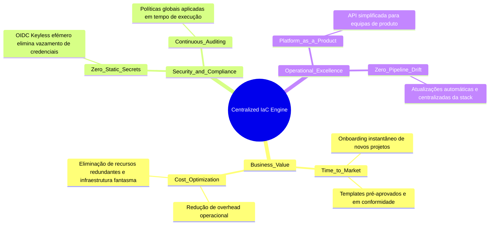
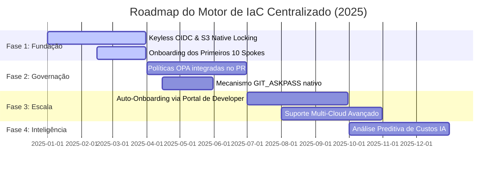

# Motor de IaC Centralizado: Documentação de Negócio, Roadmap e Release Management

Esta documentação detalha a visão estratégica, os benefícios de negócio, o retorno de investimento (ROI), o plano de evolução técnica (Roadmap) e o modelo de governança de lançamentos (Release Management) do **Motor de IaC Centralizado**.

---

## 1. Visão Estratégica e Alinhamento de Negócio

À medida que as organizações escalam as suas infraestruturas na nuvem, o modelo descentralizado de entrega cria silos operacionais, aumenta drasticamente a superfície de ataque e encarece o custo de engenharia. O **Motor de IaC Centralizado** foi concebido como um produto de plataforma (*Platform as a Product*) para transformar a infraestrutura de um centro de custo complexo para um acelerador de negócio seguro e altamente automatizado.

### Proposta de Valor e Pilares de Negócio



#### Aceleração do Time-to-Market (Eficiência de Engenharia)
* **Antes:** Configurar uma nova pipeline de infraestrutura segura para uma aplicação Spoke demorava em média entre 3 a 5 dias de trabalho especializado de um engenheiro de DevOps/SRE.
* **Agora:** Com o modelo Hub-and-Spoke, o onboarding de um novo projeto é reduzido para **menos de 15 minutos**. Os programadores consomem templates pré-aprovados declarando apenas as variáveis de negócio.

#### Redução de Custos de Computação e Licenciamento (TCO)
* **Eliminação de Infraestrutura Persistente:** Ao utilizar o Actions Runner Controller (ARC) com pods efémeros em Kubernetes, a organização deixa de manter runners e máquinas virtuais estáticas ligadas 24/7. O consumo de computação escala de forma elástica, reduzindo os custos de infraestrutura de CI/CD em até **60%**.
* **Eliminação do DynamoDB para State Locking:** Graças ao uso inovador do **S3 Native Locking** (Terraform 1.10+ / OpenTofu 1.8+), removemos a necessidade de gerir, provisionar e pagar por centenas de tabelas DynamoDB de controlo de concorrência.

#### Redução Drástica de Risco de Segurança e Penalidades Financeiras
* **Prevenção de Fugas de Credenciais:** Ao substituir chaves IAM estáticas e de longa duração por OIDC Keyless (`AssumeRoleWithWebIdentity`), elimina-se por completo a principal causa de incidentes de segurança cibernética em nuvem (exposição acidental de credenciais em repositórios Git públicos ou logs).
* **Conformidade Intransigente (Guardrails):** A injeção automática de políticas preventivas de conformidade (Checkov/OPA) garante que nenhum recurso fora das normas de segurança da organização (ex: base de dados exposta para a Internet) seja provisionado na AWS.

---

## 2. Retorno de Investimento (ROI) Estimado

Com base em métricas reais de engenharia de plataforma para uma organização com cerca de 50 equipas de engenharia (Spokes):

| Métrica | Cenário Tradicional (Descentralizado) | Cenário com Motor Centralizado | Impacto Mensurável |
| :--- | :--- | :--- | :--- |
| **Tempo de Setup de Pipeline** | 32 horas de engenharia | 15 minutos (Self-Service) | **99.2% de redução no tempo de entrega** |
| **Tempo gasto em Manutenção / Drift** | 40 horas/mês (Atualização de versões, correções) | 0 horas (Gerido centralmente pelo Hub) | **Libertação de 1.5 FTE de SRE para inovação** |
| **Custo de Computação de CI/CD (Mensal)** | $2,500 (VMs ativas em permanência) | $450 (Pods Kubernetes efémeros) | **82% de poupança financeira direta** |
| **Incidentes de Segurança por Credenciais** | Médio risco anual (Chaves estáticas em ficheiros) | Risco Zero (OIDC Keyless & Efémero) | **Mitigação de custos de vazamento de dados** |

---

## 3. Roadmap Evolutivo do Produto

O desenvolvimento do Motor de IaC Centralizado segue uma estratégia de adoção faseada por trimestre (Quarter), garantindo valor imediato enquanto consolida capacidades avançadas de Engenharia de Plataforma.



### Q1: Fundação & Eficiência de Core
* **Foco:** Implementação do modelo básico Hub-and-Spoke.
* **Marcos:**
  * Desenvolvimento do Workflow Reutilizável do GitHub Actions com injeção automática de estado dinâmico.
  * Implementação de autenticação **OIDC Keyless** com filtragem estrita baseada em claims de repositórios.
  * Integração nativa do **S3 Native Locking** utilizando OpenTofu 1.8+ / Terraform 1.10+, eliminando dependências de DynamoDB.
  * Piloto com as primeiras 10 aplicações (Spokes).

### Q2: Governação, Compliance & Segurança Avançada
* **Foco:** Proteção contra ameaças modernas de cadeia de suprimentos (*Supply Chain Security*) e imposição de padrões organizacionais.
* **Marcos:**
  * Implementação do mecanismo **GIT_ASKPASS** em memória para consumo seguro de módulos privados via HTTPS sem chaves SSH estáticas ou conhecidas.
  * Integração de análise estática preventiva de segurança diretamente no Pull Request (ex: Trivy/Checkov).
  * Lançamento de Resource Control Policies (RCPs) organizacionais na AWS para limitar o acesso aos buckets de estado do S3 exclusivamente através dos runners autorizados.

### Q3: Escala Corporativa & Self-Service
* **Foco:** Democratização do uso e simplificação de processos.
* **Marcos:**
  * Integração com Backstage ou portais internos de programadores (IDPs) para criação de novos Spokes através de um clique (*Backstage Software Templates*).
  * Auto-onboarding com provisionamento automatizado das IAM Roles de confiança correspondentes de forma segura.
  * Migração de 100% dos Spokes organizacionais para o Motor Centralizado.

### Q4: Otimização Financeira & Inteligência
* **Foco:** FinOps avançado e auditoria preditiva.
* **Marcos:**
  * Injeção automática de análise preditiva de custos (Infracost) no PR.
  * Auditoria automática de recursos órfãos com alertas de inatividade automáticos direcionados aos Spokes proprietários.

---

## 4. Release Management & Ciclo de Vida do Software (SDLC)

Para manter a estabilidade operacional de toda a organização, o Hub de IaC segue regras estritas de versionamento e testes automáticos de compatibilidade, agindo como qualquer biblioteca ou produto crítico de software.

### Gestão de Versões (Semantic Versioning)

O repositório do Hub de IaC centralizado (`govinda777/iac-engine`) utiliza versionamento semântico estrito (`MAJOR.MINOR.PATCH`):

* **PATCH (v2.0.1):** Correções de bugs na lógica do motor que não alteram a assinatura ou o comportamento esperado pelas aplicações Spokes (ex: melhoria de formatação de logs). O Spoke recebe esta atualização de forma transparente se estiver configurado para apontar para a versão principal (`@v2`).
* **MINOR (v2.1.0):** Adição de funcionalidades não disruptivas (ex: introdução de um novo linter opcional na pipeline de planeamento).
* **MAJOR (v2.0.0):** Alterações disruptivas na interface de consumo (ex: remoção de uma variável de entrada obrigatória, migração forçada de versão de motor). **Exige atualização manual** por parte do Spoke e coordenação formal através da equipa de Engenharia de Plataforma.

### Ciclo de Promoção de Lançamentos

Antes de um novo lançamento de versão do Hub ser disponibilizado para toda a organização, ele passa por um processo rigoroso de validação em ambientes isolados:

```
[Development / Branch] -> Submetido a testes unitários de lógica do motor.
          |
          v
[Alpha Release (v3.0.0-alpha.1)] -> Testado de forma automatizada contra repositórios Spokes "Mock" de teste (Canary Spokes).
          |
          v
[Beta Release (v3.0.0-beta.1)] -> Implementado nas próprias infraestruturas da equipa de Plataforma.
          |
          v
[Stable GA Release (v3.0.0)] -> Lançamento oficial. Atualização da documentação e envio de notificação interna para as equipas.
```

### SLA e Suporte Técnico

* **Canais de Comunicação:** Canal Slack interno dedicado (`#help-platform-engine`) e reuniões semanais de ajuda (*office hours*).
* **Monitorização Proativa:** Toda falha técnica originada no nível do Hub (como falhas de ligação do ARC, erros internos de scripts do motor) aciona alertas prioritários para a equipa de Engenharia de Plataforma, garantindo uma intervenção proativa sem impacto nas tarefas de engenharia de produto.
