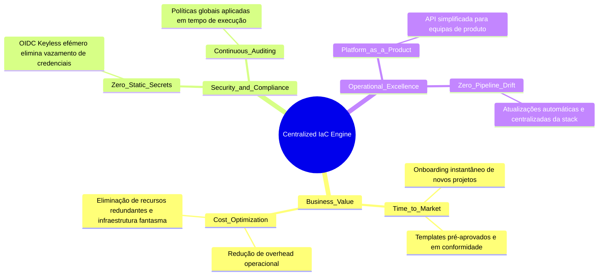
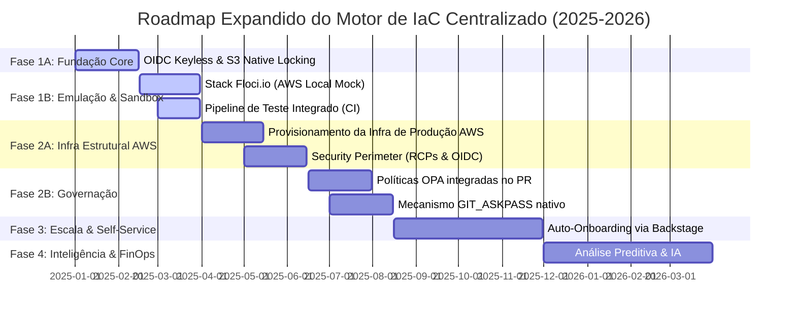
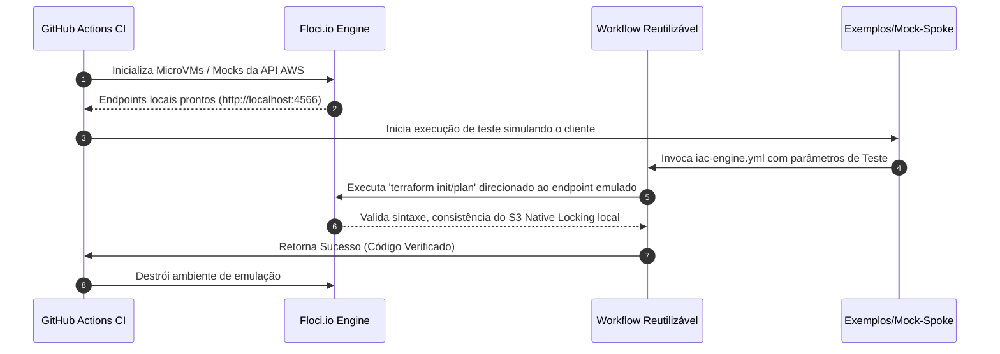

# Motor de IaC Centralizado: Documentação de Negócio, Roadmap e Release Management (V2)

Esta documentação detalha a visão estratégica, os benefícios de negócio, o retorno de investimento (ROI), o plano de evolução técnica expandido (Roadmap), a arquitetura física do repositório Hub, e o modelo de governança de lançamentos (Release Management) do **Motor de IaC Centralizado**.

---

## 1. Visão Estratégica e Alinhamento de Negócio

À medida que as organizações escalam as suas infraestruturas na nuvem, o modelo descentralizado de entrega cria silos operacionais, aumenta drasticamente a superfície de ataque e encarece o custo de engenharia. O **Motor de IaC Centralizado** foi concebido como um produto de plataforma (*Platform as a Product*) para transformar a infraestrutura de um centro de custo complexo para um acelerador de negócio seguro e altamente automatizado.

### Proposta de Valor e Pilares de Negócio



#### Aceleração do Time-to-Market (Eficiência de Engenharia)
* **Antes:** Configurar uma nova pipeline de infraestrutura segura para uma aplicação Spoke demorava em média entre 3 a 5 dias de trabalho especializado de um engenheiro de DevOps/SRE.
* **Agora:** Com o modelo Hub-and-Spoke, o onboarding de um novo projeto é reduzido para **menos de 15 minutos**. Os programadores consomem templates pré-aprovados declarando apenas as variáveis de negócio.

#### Redução de Custos de Computação e Licenciamento (TCO)
* **Eliminação de Infraestrutura Persistente:** Ao utilizar o Actions Runner Controller (ARC) com pods efémeros em Kubernetes, a organização deixa de manter runners e máquinas virtuais estáticas ligadas 24/7. O consumo de computação escala de forma elástica, reduzindo os custos de infraestrutura de CI/CD em até **60%**.
* **Eliminação do DynamoDB para State Locking:** Graças ao uso inovador do **S3 Native Locking** (Terraform 1.10+ / OpenTofu 1.8+), removemos a necessidade de gerir, provisionar e pagar por centenas de tabelas DynamoDB de controlo de concorrência.

#### Redução Drástica de Risco de Segurança e Penalidades Financeiras
* **Prevenção de Fugas de Credenciais:** Ao substituir chaves IAM estáticas e de longa duração por OIDC Keyless (`AssumeRoleWithWebIdentity`), elimina-se por completo a principal causa de incidentes de segurança cibernética em nuvem (exposição acidental de credenciais em repositórios Git públicos ou logs).
* **Conformidade Intransigente (Guardrails):** A injeção automática de políticas preventivas de conformidade (Checkov/OPA) garante que nenhum recurso fora das normas de segurança da organização (ex: base de dados exposta para a Internet) seja provisionado na AWS.

---

## 2. Retorno de Investimento (ROI) Estimado

Com base em métricas reais de engenharia de plataforma para uma organização com cerca de 50 equipas de engenharia (Spokes):

| Métrica | Cenário Tradicional (Descentralizado) | Cenário com Motor Centralizado | Impacto Mensurável |
| :--- | :--- | :--- | :--- |
| **Tempo de Setup de Pipeline** | 32 horas de engenharia | 15 minutos (Self-Service) | **99.2% de redução no tempo de entrega** |
| **Tempo gasto em Manutenção / Drift** | 40 horas/mês (Atualização de versões, correções) | 0 horas (Gerido centralmente pelo Hub) | **Libertação de 1.5 FTE de SRE para inovação** |
| **Custo de Computação de CI/CD (Mensal)** | $2,500 (VMs ativas em permanência) | $450 (Pods Kubernetes efémeros) | **82% de poupança financeira direta** |
| **Incidentes de Segurança por Credenciais** | Médio risco anual (Chaves estáticas em ficheiros) | Risco Zero (OIDC Keyless & Efémero) | **Mitigação de custos de vazamento de dados** |

---

## 3. Roadmap Evolutivo do Produto (Expandido)

Para mitigar riscos de quebras em ambientes produtivos, o ciclo de vida do motor adota uma abordagem rígida de "Shift-Left" através de emulação hermética local de nuvem e isolamento rigoroso na criação física dos recursos de suporte.



### Detalhamento Técnico das Fases

#### Fase 1A: Fundação Core & Abstração (Q1 - Início)
* **Objetivo:** Estabelecer a infraestrutura fundamental de controle lógico do motor de IaC.
* **Escopo:**
  * Criação dos fluxos reutilizáveis do GitHub Actions (`.github/workflows/iac-engine.yml`).
  * Desenvolvimento do mecanismo de injeção dinâmica de estado via propriedades `-backend-config` baseando-se no metadado `github.repository`.

#### Fase 1B: Emulação de Nuvem & Sandbox Cliente (Q1 - Final)
* **Objetivo:** Criar um ambiente de testes hermético ("Shift-Left") dentro do próprio repositório Hub para simular e validar a execução de um Spoke sem dependência de nuvem pública e com custo zero.
* **Mecanismo de Teste:** Integração da stack **Floci.io** (Firecracker Lightweight Orchestration) na pipeline de CI do Hub (`hub-ci-test.yml`). O Floci.io orquestra microVMs ultraleves executando APIs efémeras compatíveis com os serviços AWS (como S3 e IAM).
* **Validação do Motor:** A pipeline executa um ciclo de "teste em caixa-preta" (*black-box testing*) chamando o workflow reutilizável contra a pasta de exemplo de simulação `examples/mock-spoke-app/` para garantir que alterações lógicas do motor não introduzam regressões funcionais.

#### Fase 2A: Provisionamento de Infraestrutura Corporativa AWS (Q2 - Início)
* **Objetivo:** Subir e estabilizar a fundação física real da plataforma nas contas corporativas da AWS.
* **Componentes Entregues:**
  * **Clusters AWS EKS:** Provisionamento e configuração da infraestrutura de computação de Kubernetes dedicada para hospedar o Actions Runner Controller (ARC).
  * **Armazenamento Seguro de Estados:** Criação física dos buckets S3 corporativos de alta consistência protegidos por chaves geridas via AWS KMS.
  * **Arquitetura de Rede Protegida:** VPCs isoladas, Endpoints de VPC privados para o S3 (evitando tráfego de dados sensíveis pela rede pública) e NAT Gateways dedicados para a saída de internet controlada dos Runners Efémeros.

#### Fase 2B: Segurança Avançada, Perímetros & Governação (Q2 - Final)
* **Objetivo:** Proteção intransigente da cadeia de suprimentos de software (*software supply chain security*) e isolamento lógico de dados.
* **Componentes Entregues:**
  * Implementação definitiva de Resource Control Policies (RCPs) organizacionais de S3 para travar e restringir acessos a partir de IPs externos aos runners autorizados.
  * Ativação global do mecanismo `GIT_ASKPASS` seguro em memória nos runners para consumo de módulos privados.
  * Verificações estáticas em linha automáticas de segurança (Checkov/Trivy) e conformidade corporativa (OPA/Rego) diretamente acopladas ao motor de PR.

#### Fase 3: Escala & Self-Service (Q3 - Completo)
* **Objetivo:** Democratizar o consumo da plataforma de forma automatizada e escalável.
* **Componentes Entregues:**
  * Integração com portal interno de desenvolvedores (IDP) como o Spotify Backstage via Software Templates corporativos pré-aprovados.
  * Onboarding self-service de novas equipas (Spokes), criando as IAM Roles federadas necessárias com políticas de confiança isoladas de forma automática.

#### Fase 4: Inteligência & FinOps (Q4 / 2026 - Início)
* **Objetivo:** Auditoria proativa e eficiência financeira inteligente de recursos.
* **Componentes Entregues:**
  * Estimativas financeiras em tempo de execução integradas no PR (Infracost).
  * Monitorização preditiva de recursos não utilizados (recursos órfãos) com disparos de alertas de encerramento automáticos.

---

## 4. Estrutura Física Proposta para o Repositório Hub

Para acomodar nativamente os códigos de infraestrutura física, simulação local via Floci.io e testes automatizados, o repositório `iac-engine` é estruturado conforme o seguinte layout de pastas:

```text
iac-engine/ (Repositório Hub Central)
├── .github/
│   └── workflows/
│       ├── iac-engine.yml        # O workflow reutilizável principal (produção)
│       └── hub-ci-test.yml       # Pipeline de CI do próprio HUB (Fase 1B)
├── examples/
│   └── mock-spoke-app/           # PASTA SIMULADORA DO CLIENTE (SPOKE)
│       ├── .github/workflows/
│       │   └── local-deploy.yml  # Invoca o workflow central apontando para o mock
│       ├── backend.tf            # Bloco S3 vazio como exige o paradigma
│       ├── main.tf               # Declaração minimalista de recursos (ex: S3, EC2)
│       └── terraform.tfvars      # Variáveis específicas do mock cliente
├── test-infrastructure/          # Ferramentas e stacks focadas em simulação local
│   ├── floci/
│   │   ├── floci-compose.yml     # Orquestração do Floci.io para emular a API AWS
│   │   └── scripts/
│   │       └── init-aws-mocks.sh # Pré-cria o bucket de estado simulado no Floci
│   └── local-backend.tfvars      # Injetado no init local para desviar para o Floci
├── terraform-aws-infrastructure/ # Código IaC que provisiona a infra REAL da AWS (Fase 2A)
│   ├── eks-arc-cluster/          # Código para subir o cluster Kubernetes dos Runners
│   └── central-s3-backend/       # Código que cria os buckets de estado reais e RCPs
├── policies/                     # Guardrails de governança (OPA / Checkov)
└── scripts/
    └── setup_git_auth.sh         # Script efémero do GIT_ASKPASS
```

---

## 5. Arquitetura da Pipeline de Teste e Entrega (Fase 1B)

O ciclo de vida da pipeline de integração contínua do próprio Hub (`hub-ci-test.yml`) atua como o principal portão de qualidade (*quality gate*) impedindo que modificações quebrem a compatibilidade com os Spokes clientes existentes.



### Detalhe do Fluxo Hermético de CI

1. **Setup do Ambiente Local:** A pipeline de CI do Hub (`hub-ci-test.yml`) inicializa o ambiente subindo o container do **Floci.io** configurado no ficheiro `floci-compose.yml`. O script `init-aws-mocks.sh` é chamado para inicializar o bucket fictício `govinda777-iac-states-mock` e as identidades OIDC locais.
2. **Injeção de Backend Redirecionada:** O motor central identifica que está a correr sob uma bateria de testes locais e, em vez de contactar os endpoints globais da AWS, injeta os parâmetros de backend redirecionando-os para o host local do Floci.io:

```bash
# Executed in-memory by the engine during the local emulation stage
terraform init \
  -backend-config="bucket=govinda777-iac-states-mock" \
  -backend-config="key=spokes/govinda777/mock-spoke-app/terraform.tfstate" \
  -backend-config="region=us-east-1" \
  -backend-config="use_lockfile=true" \
  -backend-config="endpoint=http://localhost:4566" \
  -backend-config="skip_metadata_api_check=true" \
  -backend-config="skip_credentials_validation=true"
```

3. **Validação Caixa-Preta (Shift-Left):** O plano e a aplicação de testes rodam de forma completa contra a API mockada do S3 do Floci.io. Qualquer erro de concorrência ou problema na escrita e lock de ficheiro de estado é imediatamente alertado e o build falha. Isso garante resiliência e estabilidade absoluta antes de qualquer deploy em produção real AWS.

---

## 6. Release Management & Ciclo de Vida do Software (SDLC)

Para manter a estabilidade operacional de toda a organização, o Hub de IaC segue regras estritas de versionamento e testes automáticos de compatibilidade, agindo como qualquer biblioteca ou produto crítico de software.

### Gestão de Versões (Semantic Versioning)

O repositório do Hub de IaC centralizado (`govinda777/iac-engine`) utiliza versionamento semântico estrito (`MAJOR.MINOR.PATCH`):

* **PATCH (v2.0.1):** Correções de bugs na lógica do motor que não alteram a assinatura ou o comportamento esperado pelas aplicações Spokes (ex: melhoria de formatação de logs). O Spoke recebe esta atualização de forma transparente se estiver configurado para apontar para a versão principal (`@v2`).
* **MINOR (v2.1.0):** Adição de funcionalidades não disruptivas (ex: introdução de um novo linter opcional na pipeline de planeamento).
* **MAJOR (v2.0.0):** Alterações disruptivas na interface de consumo (ex: remoção de uma variável de entrada obrigatória, migração forçada de versão de motor). **Exige atualização manual** por parte do Spoke e coordenação formal através da equipa de Engenharia de Plataforma.

### Ciclo de Promoção de Lançamentos

Antes de um novo lançamento de versão do Hub ser disponibilizado para toda a organização, ele passa por um processo rigoroso de validação em ambientes isolados:

```
[Development / Branch] -> Submetido a testes unitários de lógica do motor.
          |
          v
[Alpha Release (v3.0.0-alpha.1)] -> Testado de forma automatizada contra repositórios Spokes "Mock" de teste (Canary Spokes).
          |
          v
[Beta Release (v3.0.0-beta.1)] -> Implementado nas próprias infraestruturas da equipa de Plataforma.
          |
          v
[Stable GA Release (v3.0.0)] -> Lançamento oficial. Atualização da documentação e envio de notificação interna para as equipas.
```

### SLA e Suporte Técnico

* **Canais de Comunicação:** Canal Slack interno dedicado (`#help-platform-engine`) e reuniões semanais de ajuda (*office hours*).
* **Monitorização Proativa:** Toda falha técnica originada no nível do Hub (como falhas de ligação do ARC, erros internos de scripts do motor) aciona alertas prioritários para a equipa de Engenharia de Plataforma, garantindo uma intervenção proativa sem impacto nas tarefas de engenharia de produto.
