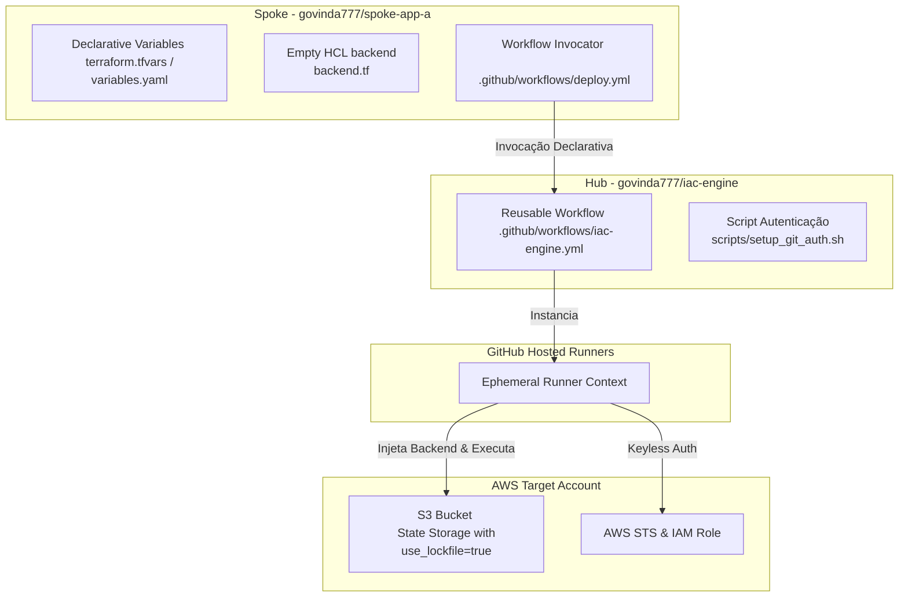
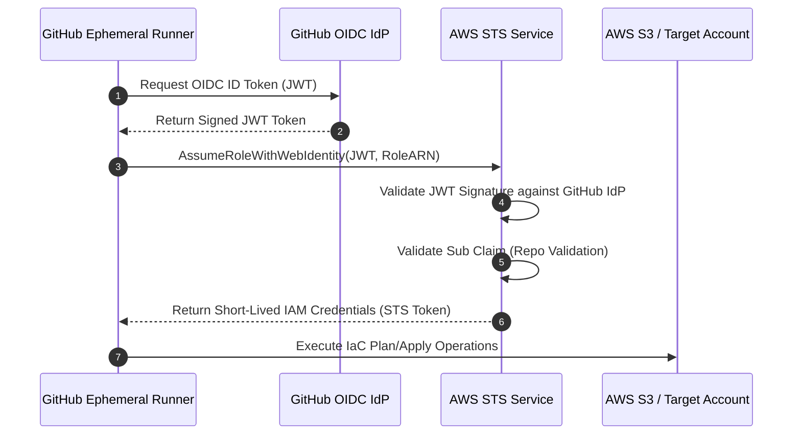

# Especificação Técnica: Motor de IaC Serverless Nativo e Efémero (Paradigma 1)

Esta especificação técnica projeta o **Motor de IaC Centralizado** sob uma premissa estritamente *serverless* e efémera: **zero computação instalada ou gerenciada por nós na AWS** (sem AWS Lambdas, sem clusters EKS dedicados, sem instâncias EC2 persistentes e sem DynamoDB para locks). O motor roda 100% de forma nativa e efémera dentro da plataforma de CI/CD do **GitHub Actions**, servindo como o Hub central de orquestração para os repositórios clientes (Spokes).

---

## 1. Arquitetura Hub-and-Spoke de Repositórios

A arquitetura adota um desacoplamento completo entre a definição do motor de execução e a declaração de recursos. Toda a computação de processamento é delegada para os runners hospedados padrão da plataforma de CI/CD (*GitHub-hosted runners*), garantindo manutenção operacional nula para a equipa de engenharia de plataforma.



### 1.1. Estruturação do Repositório Hub Central (`govinda777/iac-engine`)
O repositório do Hub atua como a única biblioteca de lógica e segurança da organização, contendo o workflow reutilizável principal e scripts auxiliares:

```yaml
# File: govinda777/iac-engine/.github/workflows/iac-engine.yml
name: Centralized IaC Engine Core

on:
  workflow_call:
    inputs:
      environment:
        required: true
        type: string
      aws_region:
        required: true
        type: string
        default: "us-east-1"
    secrets:
      token_app_id:
        required: false

jobs:
  iac-execution:
    runs-on: ubuntu-latest
    permissions:
      id-token: write
      contents: read
      pull-requests: write
    steps:
      - name: Checkout Spoke Code
        uses: actions/checkout@v4

      - name: Configure AWS Credentials (OIDC Keyless)
        uses: aws-actions/configure-aws-credentials@v4
        with:
          role-to-assume: arn:aws:iam::123456789012:role/govinda777-spoke-${{ github.event.repository.name }}-role
          aws-region: ${{ inputs.aws_region }}
          audience: sts.amazonaws.com

      - name: Setup OpenTofu / Terraform
        uses: opentofu/setup-opentofu@v1
        with:
          tofu_version: "1.8.8"

      - name: Dynamic Backend Injection & Init
        env:
          STATE_BUCKET: "govinda777-iac-states-prod"
          REPO_NAME: ${{ github.repository }}
        run: |
          tofu init \
            -backend-config="bucket=${STATE_BUCKET}" \
            -backend-config="key=spokes/${REPO_NAME}/terraform.tfstate" \
            -backend-config="region=${{ inputs.aws_region }}" \
            -backend-config="use_lockfile=true"

      - name: Plan / Apply Execution
        run: |
          if [ "${{ github.event_name }}" = "pull_request" ]; then
            tofu plan -no-color -out=tfplan
          else
            tofu apply -auto-approve
          fi
```

### 1.2. Estruturação dos Repositórios Spokes Clientes (Ex: `govinda777/spoke-app-a`)
Os repositórios clientes não possuem código de pipeline próprio, nem versões locais do Terraform, nem definições de backend ou credenciais em disco. Eles herdam e invocam estritamente o motor central:

* **Invocador de Workflow:**
```yaml
# File: govinda777/spoke-app-a/.github/workflows/deploy.yml
name: IaC Execution

on:
  pull_request:
    branches: [ "main" ]
  push:
    branches: [ "main" ]

jobs:
  trigger-iac-engine:
    uses: govinda777/iac-engine/.github/workflows/iac-engine.yml@feat/centralized-iac-engine-docs-8851655547615092863
    with:
      environment: prod
      aws_region: us-east-1
    permissions:
      id-token: write
      contents: read
```

* **Declaração de Backend Abstraída (Vazia):**
```hcl
# File: govinda777/spoke-app-a/backend.tf
terraform {
  backend "s3" {}
}
```

---

## 2. Segurança e Autenticação Federada (OIDC Keyless)

A eliminação absoluta de credenciais estáticas de longa duração da AWS é garantida através de uma federação de identidades criptográfica baseada em OpenID Connect (OIDC).

### 2.1. Fluxo OIDC Keyless com AWS
O runner efémero do GitHub Actions solicita um ID Token JWT assinado criptograficamente pelo emissor do GitHub (`token.actions.githubusercontent.com`). O runner envia este token para o **AWS STS (Security Token Service)**, que valida a assinatura e devolve credenciais de segurança efémeras de curtíssima duração (válidas por exemplo por 15 minutos).



### 2.2. Políticas de Confiança de IAM (Trust Policies) Estritas
Para garantir isolamento multi-inquilino rigoroso e mitigar o risco de o repositório do `Cliente B` assumir a Role IAM do `Cliente A`, a política de confiança da IAM Role na AWS aplica uma filtragem de claim `sub` (Subject) restrita para o repositório específico que executa o job:

```json
/* AWS IAM Trust Policy for Spoke App A Role */
{
  "Version": "2012-10-17",
  "Statement": [
    {
      "Effect": "Allow",
      "Principal": {
        "Federated": "arn:aws:iam::123456789012:oidc-provider/token.actions.githubusercontent.com"
      },
      "Action": "sts:AssumeRoleWithWebIdentity",
      "Condition": {
        "StringEquals": {
          "token.actions.githubusercontent.com:aud": "sts.amazonaws.com",
          "token.actions.githubusercontent.com:sub": "repo:govinda777/spoke-app-a:ref:refs/heads/main"
        }
      }
    }
  ]
}
```

Para uma Role de auditoria ou leitura em lote na organização, pode-se usar um filtro flexível por prefixo de nomenclatura, mantendo o controle sob o mesmo namespace organizacional:

```json
/* AWS IAM Condition with repository prefix wildcard */
"Condition": {
  "StringEquals": {
    "token.actions.githubusercontent.com:aud": "sts.amazonaws.com"
  },
  "StringLike": {
    "token.actions.githubusercontent.com:sub": "repo:govinda777/spoke-*:*"
  }
}
```

### 2.3. Governança Organizacional com Resource Control Policies (RCPs)
As **Resource Control Policies (RCPs)** aplicadas na raiz do AWS Organizations reforçam a segurança a nível global. Mesmo que uma Role OIDC temporária seja comprometida ou possua permissões excessivas, as RCPs impõem um perímetro de dados robusto sobre o bucket S3 de estados da infraestrutura corporativa:

1. **Restrição por Origem de Rede:** Bloqueia liminarmente qualquer requisição aos buckets de estados S3 que não se origine das redes corporativas autorizadas ou de blocos CIDR confiáveis de CI/CD.
2. **Prevenção de Acesso Direto Local:** Impede o download manual de ficheiros de estado (`.tfstate`) por utilizadores a partir de máquinas locais ou consoles externas ao ambiente rastreável de CI/CD, prevenindo fuga de informações e desvios de conformidade regulamentar.

---

## 3. Gestão e Abstração de Estado Dinâmico (Zero DynamoDB)

A persistência e concorrência de estados de infraestrutura são tratadas de forma totalmente nativa e sem necessidade de provisionamento de recursos de base de dados adicionais como o DynamoDB.

### 3.1. Injeção Dinâmica via CLI-Backend Config
O repositório Spoke não define qualquer detalhe de persistência em código (mecanismo *backend-less*). Durante a execução do job no runner efémero, o workflow do Hub obtém o nome do repositório de origem através da variável contextual `github.repository` (ex: `govinda777/spoke-app-a`) e injeta os parâmetros em tempo de execução através do comando de inicialização parcial do Terraform/OpenTofu:

```bash
# Executed by the Central Hub Engine on the Ephemeral Hosted Runner
tofu init \
  -backend-config="bucket=govinda777-iac-states-prod" \
  -backend-config="key=spokes/govinda777/spoke-app-a/terraform.tfstate" \
  -backend-config="region=us-east-1" \
  -backend-config="use_lockfile=true"
```

### 3.2. S3 Native Locking (Eliminação de DynamoDB)
Historicamente, o Terraform exigia uma tabela DynamoDB externa para gerir fechos (*state locks*) de infraestrutura executada sob S3 na AWS.

Ao configurar o parâmetro de backend `use_lockfile = true` (disponível no **OpenTofu 1.8+** e **Terraform 1.10+**), o mecanismo utiliza o suporte nativo a trincos de concorrência do próprio serviço de armazenamento **Amazon S3**.

* **Como Funciona:** O S3 bloqueia a escrita e gere as concorrências de escrita de forma nativa e consistente através de transações fortes internas de persistência de objetos.
* **Benefício de Engenharia:** Redução de custos diretos, eliminação completa de tabelas de banco de dados DynamoDB complexas para gerenciar e simplificação extrema de políticas de permissões IAM (menor privilégio), exigindo apenas acesso de leitura/escrita aos buckets de S3 correspondentes.

---

## 4. Gestão Segura de Dependências em Memória

Muitas receitas ou submódulos privados de infraestrutura residem em repositórios Git corporativos privados da própria organização `govinda777`. Para permitir o download destes módulos em segurança nos runners efémeros sem registar ficheiros persistentes em disco ou expor credenciais em logs, utiliza-se o mecanismo nativo `GIT_ASKPASS`.

Ao iniciar o processamento, o motor central cria dinamicamente em memória um script de autenticação efémero e exporta a variável `GIT_ASKPASS`:

```bash
#!/usr/bin/env bash
# File: setup_git_auth.sh
# Purpose: Ephemeral in-memory authentication config for downloading private Git modules via HTTPS

set -euo pipefail

# 1. Create a secure in-memory temporary script file
export GIT_ASKPASS_SCRIPT_PATH
GIT_ASKPASS_SCRIPT_PATH=$(mktemp -t git-askpass-XXXXXX.sh)

# 2. Write the authorization logic to return the ephemeral runner GITHUB_TOKEN
cat <<EOF > "$GIT_ASKPASS_SCRIPT_PATH"
#!/usr/bin/env bash
# Return the short-lived GitHub Actions runner token when prompted by Git
echo "\${GITHUB_TOKEN}"
EOF

chmod +x "$GIT_ASKPASS_SCRIPT_PATH"

# 3. Export parameters to enforce Git over HTTPS using the credential helper
export GIT_ASKPASS="$GIT_ASKPASS_SCRIPT_PATH"
export GIT_TERMINAL_PROMPT=0

# Force Git to redirect SSH repository links to secure HTTPS matching the organization
git config --global url."https://x-access-token@github.com/govinda777/".insteadOf "git@github.com:govinda777/"

# Upon execution job completion, the runner automatically deletes the temporary file:
# rm -f "$GIT_ASKPASS_SCRIPT_PATH"
```

---

## 5. Ciclo de Vida do PR e Detecção Reativa de Drift

Como o motor opera sob uma premissa 100% efémera e efémera e sem dependências de infraestrutura persistente ativa, o ciclo de vida do PR e a deteção de desvios de infraestrutura (*drift*) são gerenciados através de eventos e agendadores nativos da plataforma.

### 5.1. Ciclo de Vida de Pull Request e Merge
O ciclo de vida operacional segue duas fases claras baseadas em eventos Git:

```
[ Criação / Atualização de Pull Request ]
                |
                v
  (Fase de Planeamento / Preview)
  Calcula diferenças lógicas com 'tofu plan'
  Publica o resumo detalhado em Markdown no PR
                |
                +---> [ PR Fundido (Merge) na Branch Main ]
                                 |
                                 v
                     (Fase de Aplicação / Deploy)
                     Executa 'tofu apply -auto-approve'
                     Persiste as alterações e atualiza estado
```

1. **Fase de Planeamento (Preview):** Disparada em eventos `pull_request`. O motor executa o `tofu plan` de forma puramente consultiva, captura o retorno do plano técnico, formata o cálculo de diferenças em Markdown polido e publica-o diretamente como um comentário na interface de conversação do Pull Request correspondente.
2. **Fase de Aplicação (Deploy):** Disparada estritamente após a fusão (*merge*) do PR na branch principal `main`. O motor executa o `tofu apply` definitivo, aplicando as mudanças físicas na AWS e guardando o ficheiro de estado atualizado com S3 Native Locking.

### 5.2. Estratégia de Detecção Reativa de Drift
pipelines tradicionais de CI/CD operam em modo puramente episódico (reagem apenas a eventos ativos do Git). Alterações manuais feitas diretamente na consola da AWS ou intervenções externas (*out-of-band updates*) não disparam pipelines e constituem um risco grave de desvio (*drift*).

Para mitigar esta vulnerabilidade de forma 100% efémera e efémera (sem servidores de varredura contínua ligados 24/7), implementa-se uma **Estratégia de Detecção Reativa baseada em Cron Jobs do GitHub Actions**:

```yaml
# File: govinda777/iac-engine/.github/workflows/drift-detector.yml
name: Reactive Drift Detector

on:
  schedule:
    # Runs everyday at 02:00 AM UTC
    - cron: "0 2 * * *"

jobs:
  audit-drift:
    runs-on: ubuntu-latest
    permissions:
      id-token: write
      contents: read
      issues: write
    strategy:
      matrix:
        # Array of registered Spoke repositories to audit
        spoke_repo: [ "spoke-app-a", "spoke-app-b" ]
    steps:
      - name: Checkout Spoke Code
        uses: actions/checkout@v4
        with:
          repository: govinda777/${{ matrix.spoke_repo }}

      - name: Configure AWS Credentials (ReadOnly Audit Role)
        uses: aws-actions/configure-aws-credentials@v4
        with:
          role-to-assume: arn:aws:iam::123456789012:role/govinda777-spoke-${{ matrix.spoke_repo }}-audit-role
          aws-region: us-east-1

      - name: Setup OpenTofu
        uses: opentofu/setup-opentofu@v1
        with:
          tofu_version: "1.8.8"

      - name: Dynamic Backend Initialization
        env:
          STATE_BUCKET: "govinda777-iac-states-prod"
          REPO_NAME: govinda777/${{ matrix.spoke_repo }}
        run: |
          tofu init \
            -backend-config="bucket=${STATE_BUCKET}" \
            -backend-config="key=spokes/${REPO_NAME}/terraform.tfstate" \
            -backend-config="region=us-east-1" \
            -backend-config="use_lockfile=true"

      - name: Audit Drift
        id: drift_check
        run: |
          # Detailed-exitcode returns:
          # 0 = No changes, 2 = Drift detected, 1 = Error
          set +e
          tofu plan -detailed-exitcode -no-color > drift_report.log
          EXIT_CODE=$?
          set -e
          echo "exit_code=$EXIT_CODE" >> $GITHUB_OUTPUT
          cat drift_report.log

      - name: Raise Drift Alert Issue
        if: steps.drift_check.outputs.exit_code == '2'
        uses: actions/github-script@v7
        with:
          github-token: ${{ secrets.GITHUB_TOKEN }}
          script: |
            const fs = require('fs');
            const report = fs.readFileSync('drift_report.log', 'utf8');
            await github.rest.issues.create({
              owner: 'govinda777',
              repo: '${{ matrix.spoke_repo }}',
              title: '🚨 ALERT: Infrastructure Drift Detected in AWS',
              body: `An automatic daily audit has detected differences between the declared IaC configuration and the actual state of your resources in AWS.\n\n### Drift Details:\n\`\`\`text\n${report}\n\`\`\`\n\n_Please review and approve a pull request or manually revert the change on AWS to reconcile._`
            });
```

* **Vantagem desta Abordagem:** Consumo de recursos de computação estritamente sob demanda (efémero), custo nulo em tempo de inatividade e alertas automáticos criados diretamente como Issues nos respetivos repositórios dos Spokes clientes.
